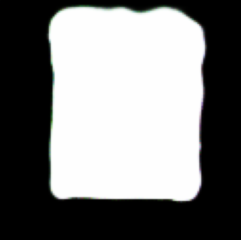
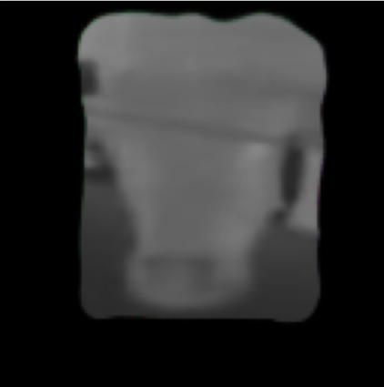
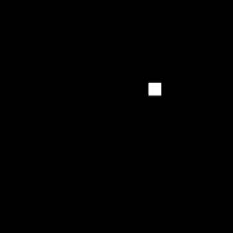
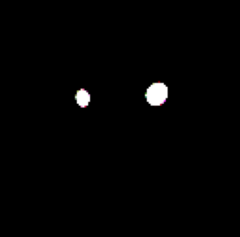
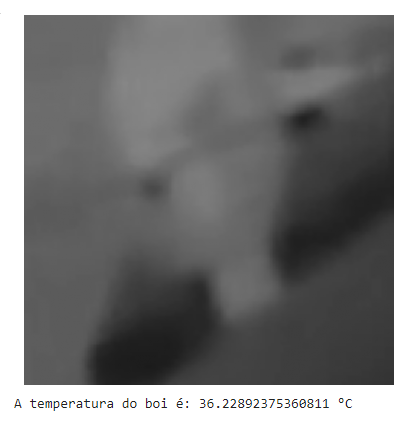
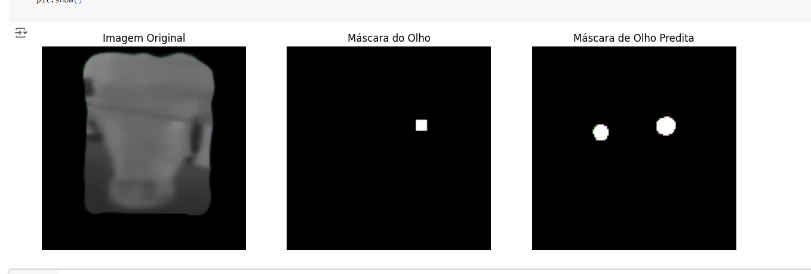

# Monitoramento de Temperatura Corporal de Bovinos Utilizando Segmentação Ocular em Imagens Térmicas com Redes Neurais Convolucionais

#### Autores: Giuliano Bontempo Domiciano; Guilherme Novaes Lima; Marcelo Maia Fernandes Filho; Mariana Brasil Görresen; Samuel Lucas de Almeida.

## Resumo

O monitoramento da temperatura corporal de bovinos é fundamental para a detecção preventiva de problemas de saúde. A termografia infravermelha (IRT) tem se mostrado uma ferramenta valiosa nesse processo. Este estudo apresenta o desenvolvimento de um sistema de inteligência artificial (IA) para automatizar a segmentação das regiões oculares de bovinos em imagens térmicas, permitindo a medição da temperatura corporal em tempo real. Utilizando uma arquitetura U-Net baseada na VGG16 e modelos de detecção de objetos, o sistema segmenta com precisão as regiões da cabeça e dos olhos dos bovinos. Os resultados da segmentação são então usados para extrair os dados de temperatura da região ocular, oferecendo um método não invasivo para monitorar a saúde dos animais. O modelo foi treinado utilizando imagens térmicas rotuladas, com etapas de pré-processamento, incluindo extração de frames e redimensionamento de imagens. O sistema de segmentação ocular alcançou uma precisão de 62,09% e um recall de 52,3%, demonstrando seu potencial para aprimorar o monitoramento da saúde bovina por meio da avaliação automatizada da temperatura.

## 1. Introdução

A medição da temperatura corporal é uma prática essencial no monitoramento da saúde do gado, sendo particularmente útil[[1]](#1), na detecção precoce de estresse térmico e doenças infecciosas. Entre as diversas regiões do corpo, a área ocular tem se mostrado uma das mais adequadas para medir a temperatura corporal usando termografia infravermelha (IRT), devido à sua correlação próxima com a temperatura central do animal[[2]](#2). No entanto, o uso de câmeras térmicas em frigorificos enfrenta desafios devido à quantidade de bois e a natureza recorrente da necessidade de medição.

Para contornar essas limitações, abordagens baseadas em inteligência artificial (IA), especialmente redes neurais convolucionais (CNNs), têm sido aplicadas com sucesso para segmentar regiões de interesse em imagens térmicas, como os olhos de bovinos[[3]](#3). A automação desses processos permite uma coleta e análise contínua e precisa das imagens, mesmo em cenários de alta variabilidade. O presente estudo visa desenvolver um sistema de segmentação ocular baseado em IA para extrair automaticamente a temperatura do olho de bovinos, proporcionando uma solução eficiente para monitorar a saúde animal em tempo real.

## 2. Metodologia

### 2.1. Escolha e utilização das ferramentas

Para a etapa de labeling durante a construção do dataset, foi necessária a utilização de uma ferramenta que facilitasse esse processo, garantindo que as seguintes tarefas fossem concluídas:

1. Realizar o recorte de fotografias durante a filmagem que, mesmo com presença de ruído, apresentassem cabeças dos bovinos em diferentes posições e perspectivas, incluindo ou não os olhos.
2. Diferenciar o contexto — ou seja, olhos e cabeça — do restante (ruído) nesse recorte.
3. Assegurar que os membros do animal, cabeça e olhos, fossem distinguíveis entre si.

Para atingir esses objetivos, foi utilizada a ferramenta CVAT [[4]](#4) (Computer Vision Annotation Tool), amplamente reconhecida no treinamento de modelos de inteligência artificial e que facilita o processo de rotulagem (labeling).

No estudo conduzido por Musleh, AlRyalat e Qasem (2023) [[5]](#5), foram analisados 131 softwares de rotulagem, dos quais 10 foram selecionados como os mais práticos. Entre esses 10, apenas duas opções são gratuitas: uma delas é predominantemente utilizada na área da saúde, enquanto a outra é o CVAT. Com base na análise feita no artigo citado e na comparação entre as ferramentas, concluiu-se que o CVAT era a escolha ideal para o grupo. A plataforma CVAT destaca-se por oferecer tanto uma versão web quanto uma versão instalável. Para a utilização, o fato de oferecer uma versão web foi um diferencial importante, pois permitiu que qualquer pessoa do grupo conseguisse acessar a ferramenta independentemente do sistema operacional de suas máquinas, garantindo assim a padronização do material coletado ao longo da pesquisa.

<div align=center>

<br/><a id="cvat-config-task">Figura 1</a>
<br/>Fonte: <a href="https://docs.cvat.ai/">CVAT Docs</a>
</div>
<br/>
<div align=center>

<br/><a id="cvat-config-task-label">Figura 2</a>
<br/>Fonte: <a href="https://docs.cvat.ai/">CVAT Docs</a>
</div>

### 2.2. Criação de labels

No contexto da geração das labels, ou seja, das máscaras de segmentação que serão utilizadas como dados de treino para o modelo, foi inicialmente necessário realizar a seleção dos frames que serviram para tal segmentação. Nesse sentido, foi desenvolvido um script que seleciona dois frames da imagem e calcula a diferença entre eles. Esse código tem por objetivo selecionar frames em posições distintas, garantindo a variedade dos dados de treinamento. Abaixo é mostrado o pseudocódigo e um exemplo da diferença entre imagens:

```python
Função calcular_porcentagem_diferenca(imagem1, imagem2):
    # Converter imagem1 para escala de cinza e armazenar em img1_cinza
    img1_cinza = converter_para_cinza(imagem1)
    
    # Converter imagem2 para escala de cinza e armazenar em img2_cinza
    img2_cinza = converter_para_cinza(imagem2)
    
    # Calcular a diferença absoluta entre img1_cinza e img2_cinza e armazenar em diferenca
    diferenca = calcular_diferenca_absoluta(img1_cinza, img2_cinza)
    
    # Aplicar um limiar na diferença para destacar as diferenças significativas e armazenar em limiarizado
    limiarizado = aplicar_limiar(diferenca, 30)
    
    # Contar o número de pixels diferentes (não zero) no limiarizado
    contagem_nao_zero = contar_pixels_nao_zero(limiarizado)
    
    # Calcular o número total de pixels na imagem
    total_de_pixels = calcular_tamanho_da_imagem(limiarizado)
    
    # Calcular a porcentagem de pixels diferentes
    porcentagem_diferenca = (contagem_nao_zero / total_de_pixels) * 100
    
    # Retornar a porcentagem de diferença calculada
    Retornar porcentagem_diferenca

```

A figura abaixo mostra a diferença entre cada um dos frames selecionados para o treino do modelo. A célula da matriz é do tipo $\text{f}_i$ x $\text{f}_j$, ou seja, "i-ésimo" frame comparado com o "j-ésimo" frame

<div align=center>

<br/><a id="diferenca-entre-frames">Figura 3</a>
</div>

Após a seleção das imagens, esses frames foram inseridos na ferramenta CVAT[[4]](#4), clicando em "Create a new project". Em seguida, é possível selecionar a ferramenta que deve ser utilizada para fazer os recortes, com a seleção retangular, o grupo diferenciou a amostras em contexto (cabeça do bovino + ruído), a cabeça por si só e os olhos, sendo cada olho pertencente a uma label diferente.

<div align=center>

<br/><a id="exemplo-label">Figura 4</a>
</div>

Replicando este processo para todos os frames, o grupo conseguiu fazer a seleção das labels necessárias para o preenchimento do dataset. Baixando um arquivo ".xml" (Extensible Markup Language), clicando em "Export annotations", foi gerado o arquivo "annotations.xml" que indica todos os metadados das seleções realizadas (Nome das labels, datas, coordenadas das labels na imagem original, entre outras informações). Esse arquivo foi posteriormente utilizado para a construção de fotografias segmentadas que seriam utilizadas efetivamente para treinar o modelo.

### 2.3. Exportação das anotações

Após a criação das anotações na plataforma CVAT, os dados são exportados em um arquivo .xml contendo as coordenadas das labels em relação aos frames originais dos vídeos.A padronização dos dados é essencial para assegurar a qualidade e transparência dos conjuntos de dados, permitindo uma melhor compreensão e utilização dos mesmos[[6]](#6). Com o objetivo de otimizar o treinamento do modelo de IA, o dataset foi padronizado, definindo-se um tamanho fixo de 128x128 pixels para as imagens de treinamento e organizando os _paths_ (caminhos de diretório onde os arquivos estão armazenados) dessas imagens com informações como a data do vídeo, o nome original do vídeo, o número do frame, a identificação do boi e se a imagem corresponde a X ou y. Para aplicar essa padronização, foi utilizado um script Python que emprega a biblioteca OpenCV para processar os frames a partir dos arquivos exportados do CVAT e das imagens originais [[Fig. 5]](#imagem-termica-1). Esse processamento gera, para cada frame com label, duas imagens essenciais para o treinamento do modelo, ambas com seus _paths_ padronizados: a imagem X [[Fig. 6]](#rosto-termica-1), um recorte retangular da cabeça do boi junto com parte do contexto do frame, e a imagem y [[Fig. 7]](#label-1), que contém uma máscara identificadora do rosto do boi, onde o rosto aparece como um polígono branco e os olhos são destacados em polígonos vermelhos.

<div align=center>

<br/><a id="imagem-termica-1">Figura 5 - Exemplo de frame original utilizado para o recorte das labels</a>
</div>
<br/>
<div align=center>

<br/><a id="rosto-termica-1">Figura 6 - Label X com o recorte contextual do boi 1</a>
</div>
</br>
<div align=center>

<br/><a id="label-1">Figura 7 - Label y com máscara de identificação do rosto e olhos do boi</a>
</div>


### 2.4. Pré-processamento

Para que a entrada se enquadrasse no padrão estabelescido pela rede neural e que o processamento computacional fosse otimizado, os dados passaram por uma etapa de pré-processamento. 

Inicialmente, o usuário fornece um vídeo como a entrada. Esse vídeo é dividido em frames de acordo com a sua taxa de quadros por segundo. Para reduzir o processamento e ainda garantir que dados não estão sendo perdidos, foram armazenados os frames de 20 em 20 quadros, diminuindo a ocorrência de frames muito parecidos.

Após essa separação, um modelo produzido de _object detection_, que será discutido posteriormente, faz inferências na imagem com o objetivo de identificar a cabeça do gado com um certo nível de ruído, isso faz com que a quantidade de informações passadas para os próximos modelos sejam drasticamente reduzidas, aumentando ainda mais sua eficiência.

Por fim, as imagens com as cabeças são redimensionados para o padrão estabelecido de 128 x 128. Todo esse processo foi ilustrado no diagrama[[Fig. 8]](#pre-process) abaixo.

<div align=center>

<br/><a id="pre-process">Figura 8 - Pré processamento</a>
</div>


### 2.5. Arquitetura do modelo de Segmentação 
O modelo de segmentação foi desenvolvido utilizando a arquitetura VGG16 como backbone, integrada com uma estrutura de rede U-Net. A combinação dessas duas arquiteturas permite a segmentação eficiente das regiões de interesse, especificamente os olhos e a cabeça dos bovinos. A seguir, é detalhado o funcionamento de cada componente e como eles se integram para formar o modelo completo.


#### 2.5.1. VGG16 como Backbone
A VGG16 é uma rede neural convolucional (CNN)[[7]](#7), conhecida por sua simplicidade e eficácia na extração de características essenciais das imagens. A arquitetura da VGG16 consiste em 16 camadas, incluindo convoluções e pooling, seguidas de camadas totalmente conectadas. Tal ferramenta foi utilizada devido à sua eficiência na identificação e  extração de características fundamentais das imagens, como texturas, bordas e formas, além de ser amplamente utilizada em modelos de visão computacional[[8]](#8).

* Camadas Convolucionais: A VGG16 é composta por blocos de camadas convolucionais, onde cada bloco é seguido por uma operação de pooling que reduz a dimensionalidade espacial da imagem, mantendo as características mais relevantes.

* Congelamento de Camadas: As camadas mais baixas da VGG16, responsáveis pela captura de características de baixo nível, como bordas e texturas, foram mantidas congeladas (não treináveis) para preservar as características previamente aprendidas e acelerar o treinamento do modelo.


#### 2.5.2. Estrutura U-Net
A U-Net é uma arquitetura amplamente utilizada para tarefas de segmentação semântica, caracterizada por sua estrutura simétrica em forma de "U". Ela combina operações de convolução com camadas de transposição convolucional (_upsampling_), permitindo a recuperação da resolução original da imagem, ao mesmo tempo que preserva as informações contextuais extraídas nas camadas de _downsampling_ [[9]](#9).

O processo realizado pelo encoder reduz a dimensão da matriz de entrada enquanto aumenta o número de canais[[10]](#10). Para atingir esse objetivo, a arquitetura U-Net realiza uma série de operações de convolução e pooling. Esse processo gera um mapa de características ou vetor que contém as informações essenciais da entrada, que serão posteriormente utilizadas pelo decoder. O _downsampling_ é uma técnica central dentro do encoder, usada para reduzir a dimensão espacial da imagem durante a codificação [[9]](#9).

O decoder na U-Net reconstrói a imagem segmentada a partir do mapa de características gerado pelo encoder[[11]](#11). Ele expande a dimensão espacial da imagem usando _upsampling_ e convoluções transpostas, complementadas por conexões de salto das camadas correspondentes de _downsampling_, o que preserva detalhes finos que poderiam ser perdidos no processo de _downsampling_.

Após esse processo, as camadas finais da U-Net geram uma máscara de segmentação, onde cada pixel é classificado em uma das classes de interesse (por exemplo, olho, cabeça ou fundo).

Pseudo-código da implementação do modelo:

```python
Função modelo_unet(formato_entrada):
    vgg16 = carregar_vgg16(formato_entrada)
    saída_vgg16 = saída(vgg16)
    
    Para cada camada em camadas(vgg16[:-4]):
            camada.treinavel = Falso

    saída_unet = construir_camadas_unet(saída_vgg16)
    
    modelo = CriarModelo(entradas=vgg16.entrada, saídas=saída_unet)
    return modelo
```

Neste pseudo-código:

1. VGG16 é carregada com pesos pré-treinados e utilizada para extrair características essenciais das imagens.
2. As quatro últimas camadas da VGG16 são congeladas para manter as características previamente aprendidas.
3. As saídas da VGG16 são alimentadas na estrutura da U-Net, que realiza o upsampling e a segmentação das regiões de interesse.
4. O modelo final é composto pelas entradas da VGG16 e pelas saídas da U-Net, integrando as duas arquiteturas para formar uma rede de segmentação poderosa e eficiente.

Essa integração permite que o modelo capture tanto detalhes locais quanto informações contextuais, resultando em uma segmentação das regiões de interesse nos bovinos.

#### 2.5.3. Modelo de Segmentação da Cabeça e Olhos
O processo de segmentação foi abordado em duas etapas principais para melhorar a precisão do modelo: a segmentação da cabeça do bovino e, em seguida, a segmentação dos olhos.

* **Segmentação da Cabeça:** Primeiramente, um modelo baseado na arquitetura VGG16-Unet foi treinado para identificar a cabeça do bovino nas imagens térmicas. Esse modelo recebe uma imagem 128x128px com a cabeça do boi e gera uma máscara que destaca a região da cabeça, excluindo outras partes do corpo e o fundo da imagem. Essa máscara é essencial para restringir a área de interesse, facilitando a precisão da segmentação subsequente dos olhos.

* **Segmentação dos Olhos:** O output gerado pela segmentação da cabeça será utilizado para aplicar uma máscara no X original, resultando em um novo X que restringe a área de interesse apenas à cabeça do bovino. Esse novo X serve como input, juntamente com o Y de label dos olhos, para o modelo de segmentação do olhos, que segue a mesma arquitetura VGG16-Unet utilizada no modelo de segmentação da cabeça, mas com um objetivo específico de segmentação ocular. O modelo então entrega como resultado uma imagem segmentada que destaca com precisão a localização dos olhos do bovino.

Essa abordagem em duas etapas garante que o modelo possa lidar com a complexidade das imagens térmicas, segmentando as regiões de interesse de forma mais eficaz e reduzindo o ruído nas etapas subsequentes de processamento.

### 2.6. Modelo de Object detection

Para otimizar o processo de segmentação e garantir a precisão das regiões de interesse (cabeça e olhos dos bovinos), foi implementado um modelo de object detection como etapa preliminar. Utilizando o Roboflow Train 3.0, a preparação dos dados e o treinamento do modelo foram realizados de maneira eficiente, facilitando a integração do modelo no pipeline de processamento de imagens.

#### 2.6.1. Detecção da Cabeça do Boi com Modelo de Object Detection

1. Uso do Roboflow Train 3.0:

   * O Roboflow Train 3.0 foi empregado para realizar o treinamento do modelo de detecção de cabeças dos bovinos.
   * As funcionalidades do Roboflow permitiram um pré-processamento automatizado das imagens, incluindo o ajuste de contraste, normalização e aumento de dados (data augmentation).
   * O processo de anotação das imagens e a criação das caixas delimitadoras (bounding boxes) para as cabeças dos bovinos foram simplificados por meio das ferramentas de anotação e gerenciamento de datasets do Roboflow.

2. Treinamento do Modelo:

    * A arquitetura YOLOv5 foi utilizada como base para o treinamento, oferecendo um equilíbrio entre precisão e velocidade.
    * Durante o treinamento, foram realizados ajustes nos hiperparâmetros, como taxa de aprendizado e número de camadas, a fim de melhorar a capacidade do modelo de detectar a cabeça dos bovinos em diferentes condições de iluminação e posições.
    * A integração com o Roboflow Train 3.0 permitiu monitoramento contínuo e ajustes dinâmicos durante o treinamento, garantindo um modelo otimizado para detecção.

3. Criação de Crops das Cabeças:

    * Com as coordenadas obtidas pelas caixas delimitadoras, cada cabeça de bovino foi isolada por meio de operações de crop no frame original.
    * Os crops gerados foram padronizados em termos de tamanho e proporção para garantir uma entrada consistente nos modelos de segmentação.

4. Fluxo de Processamento:

   * O pipeline começa com a detecção das cabeças dos bovinos em cada frame do vídeo utilizando o modelo treinado no Roboflow Train 3.0.
   * A detecção gera coordenadas que são usadas para realizar o corte (crop) do frame, resultando em imagens menores contendo apenas a cabeça do bovino.
   * As imagens crops são então utilizadas como entrada para os modelos de segmentação, que foram otimizados para detectar e segmentar regiões como olhos e contornos da cabeça.

### 2.7. Métricas

#### 2.7.1. Função de perda

A função de perda é responsável pela interação dos dados de treino com o modelo. Ela é responsável pelo cálculo do gradiente, que, por sua vez, fará a alteração dos pesos, ocasionando no aprendizado. A série de funções de perda é gerada a cada passo do aprendizado, definindo os padrões alvo que podem ser usados como sinal de supervisão durante o _backpropagation_[[12]](#12).

Para o presente modelo, foi escolhido a função de perda de Dice, um método muito utilizado em redes convolucionais. Seu objetivo é o de penalizar o modelo quando a predição de uma segmentação difere do _ground truth_, fazendo essa comparação usando a teoria de conjuntos. A função foi definida na figura abaixo [[Fig. 9]](#dice-loss).

Um dos motivos pela escolha dessa função foi a sua capacidade de abstrair padrões mesmo com o desbalanceamento de classes, isso quando comparando os pixels pretos com os brancos [[13]](#13). Isso significa que o modelo terá uma maior proficiência em distinguir o que faz parte do fundo, do que não faz, ou seja, conseguindo diferenciar melhor os bovinos, do ambiente em que eles se encontram.

$$
L = \frac{2|y \cap \hat{y}|}{|y| + |\hat{y}|}
$$

$$
\small{y \text{: Ground truth}}
$$

$$
\small{\hat{y} \text{: Prediction}}
$$

<div align=center>
<br/><a id="dice-loss">Figura 9 - Dice Loss Function</a>
</div>
</br>
</br>
<div align=center>

<br/><a id="masks-1">Figura 10 - Máscaras 1</a>
</div>

A saída desejada do modelo é uma máscara de segmentação preta e branca. Sendo assim, na função de perda, ele atua como uma imagem de apenas um canal que mostra a brilho de cada pixel, numa escala de 0-255, sendo 0 o equivalente à cor preta e 255, ao branco. Por isso, no caso do presente modelo, a cardinalidade de cada conjunto ($|y|$, $|\hat{y}|$) que entra na função de perda se refere ao número de pixels brancos dentro desse conjunto. Já a cardinalidade da interseção ($|y \cap \hat{y}|$) entra como o número de pixels que são brancos em ambas as imagens simultaneamente. [[Fig. 10]](#masks-1)

<!--
Após a realização de testes com o curto período de treino para a avaliação dessa função de perda, o modelo apresentou um desempenho relativamente positivo quando levando em consideração o número de épocas. [[Fig. 10]](#loss-acc)

<div align=center>

<br/><a id="loss-acc">Figura 10 - Treino de modelo de curto aprendizado com dice loss</a>
</div>
<br>
-->

### 2.8. Técnicas Contra Overfitting do Modelo

Uma parte fundamental no desenvolvimento do modelo é a prevenção de overfitting. O overfitting ocorre quando o modelo se ajusta excessivamente aos dados de treinamento, capturando ruídos e padrões específicos dessa amostra, o que compromete sua capacidade de generalização[[14](#14)].

Existem várias estratégias para prevenir o overfitting, sendo uma das mais comuns e intuitivas o Early Stopping. Esse método interrompe o treinamento assim que o modelo começa a mostrar sinais de overfitting, no modelo desenvolvido o Early Stopping foi configurado para encerrar o treinamento caso não haja uma melhora na acurácia durante cinco épocas de treino. O Early Stopping é considerado uma abordagem eficaz e direta, pois não interfere diretamente nos dados de treinamento.

Além disso, utiliza-se o Dropout que consiste em desativar de forma aleatória uma fração dos neurônios durante o treinamento, forçando o modelo a não depender excessivamente de nenhuma combinação específica de neurônios[[15]](#15). Isso promove a aprendizagem de representações mais generalizadas, tornando o modelo mais robusto e menos propenso a se ajustar aos padrões específicos do conjunto de treino(overfitting).

Outras técnicas contra o overfitting também estão sendo utilizadas como Batch Normalization, que ajuda a estabilizar o processo de treinamento, normalizando as ativações e reduzindo o risco de que o modelo se ajuste demais aos dados de treinamento. O congelamento das últimas camadas do modelo VGG-16 evita o overfitting, pois preserva as características gerais que foram aprendidas em grandes bases de dados como o ImageNet, mas também acelera o treinamento do modelo, tendo em vista que essas camadas não serão treinadas.

No entanto, a prevenção do overfitting é um desafio contínuo. É importante considerar a aplicação futura de outras técnicas[[16]](#16), que podem permitir um adiamento do Early Stopping, proporcionando ao modelo mais épocas de treinamento sem comprometer sua capacidade de generalização.

### 2.9. Captura da temperatura nos olhos

Durante a análise da captura do material para a construção do dataset, percebeu-se que a temperatura máxima e mínima, indicada em cada frame capturado pela camera térmica, era _hard-encoded_ na imagem, ou seja, a única forma de capturar esses valores de forma digital seria através da leitura dos pixels da fotografia, uma vez que esses dados não estavam presentes nos metadados dos arquivos ou em qualquer outro arquivo de anotação.

Para conseguir automatizar o processo de identificação desses valores de temperatura na imagem, foi necessário a elaboração de uma estratégia que conseguisse ler a imagem, seccionar os dígitos numéricos de interesse e aplicar um algoritmo para converter a foto do digito em valores numéricos acessíveis para a manipulação memória.

No primeiro passo, o local onde os dígitos se encontravam na imagem foram manualmente mapeados, uma vez que esse local era fixo em todas as imagens. Posteriormente, cada dígito foi recortado da fotografia original, de forma com que a amostra focasse individualmente na imagem de cada dígito, evitando que outras partes da imagem dificultassem a identificação desse dígito.

Com os dígitos devidamente isolados, foi aplicado um algoritmo de OCR (Optical Character Recognition)[17](#17), que permite a extração de texto ou números diretamente das imagens. Esse processo foi crucial para a obtenção precisa dos valores da escala de temperatura, extraindo-os diretamente dos dígitos termográficos presentes nas fotos. 

Após a obtenção dos valores mínimo e máximo da escala de temperatura de cada frame, bem como do resultado do modelo de segmentação da região ocular, é possível calcular a média da intensidade dos pixels dos olhos dos bovinos. Embora a escala termográfica possa variar entre as imagens, as intensidades dos pixels que correspondem às temperaturas máxima (pixel mais claro) e mínima (pixel mais escuro) permanecem consistentes. Dessa forma, com os valores termográficos devidamente extraídos e a média das intensidades dos pixels da região dos olhos, aplica-se uma função que mapeia a intensidade do pixel em uma temperatura real. Essa função utiliza uma relação linear entre a intensidade do pixel e a faixa de temperatura obtida, permitindo uma estimativa precisa da temperatura ocular dos bovinos.

<div align=center>

<br/><a id="digits-dataset">Figura 11 - Dataset dígitos</a>
</div>
<br/>
<br/>
<div align=center>

<br/><a id="digit-compare">Figura 12 - Comparação dígito com dataset</a>
</div>

## 3. Resultados

### 3.1. Segmentação da Cabeça: 
O modelo de segmentação da cabeça foi bem-sucedido em gerar máscaras precisas que destacam a cabeça do bovino em imagens térmicas. A [Figura 13](#output_mask) mostra um exemplo de saída onde a cabeça do bovino é claramente isolada, o que facilita as etapas subsequentes de segmentação.
  
### 3.2. Segmentação dos Olhos: 
Com a aplicação da máscara de segmentação da cabeça, a área de interesse foi restrita, permitindo ao modelo de segmentação dos olhos trabalhar com maior precisão. A [Figura 14](#input_eyes) ilustra a máscara aplicada sobre o X original, removendo o fundo irrelevante. A [Figura 15](#Y_eyes) exibe os labels dos olhos usados no treinamento, e a [Figura 16](#output_eyes) mostra o resultado final da segmentação, em que os olhos são corretamente identificados e isolados.

#### Imagens de resultados dos modelos
<div style="display: flex; justify-content: center; gap: 20px; flex-wrap: wrap;">
  <div style="text-align: center;">
    
    <br/><a id="output_mask">Figura 13 - Exemplo de output do modelo de segmentação da cabeça</a>
  </div>
  <div style="text-align: center;">
    
    <br/><a id="input_eyes">Figura 14 - Exemplo de máscara aplicada no X original</a>
  </div>
  <div style="text-align: center;">
    
    <br/><a id="Y_eyes">Figura 15 - Exemplo de label dos olhos</a>
  </div>
  <div style="text-align: center;">
    
    <br/><a id="output_eyes">Figura 16 - Exemplo de output do modelo de segmentação dos olhos</a>
  </div>
</div>

### 3.3. Detecção com Roboflow Train 3.0

Com a implementação do Roboflow Train 3.0, foi possível obter um modelo de detecção de cabeças de bovinos robusto, resultando em melhorias significativas na preparação das imagens para segmentação.

1. Precisão da Detecção:

    * O modelo de detecção treinado com Roboflow Train 3.0 alcançou uma taxa de precisão de 85,9% na detecção das cabeças, indicando uma precisão superior às abordagens anteriores.

    * A utilização do Roboflow permitiu uma anotação mais consistente das regiões de interesse e um melhor ajuste dos hiperparâmetros do modelo, minimizando a ocorrência de falsos positivos e negativos.

2. Redução no Tempo de Processamento:

    * O uso do Roboflow, em conjunto com o modelo YOLOv5, proporcionou um tempo de inferência rápido, permitindo a detecção em tempo real das cabeças dos bovinos.

### 3.4. Métricas

| **Modelo**                     | **Loss** | **Precisão (Precision)** | **Recall** | 
|---------------------------------|----------|--------------------------|------------|
| **Treinamento (Segmentação Olhos)** | 0.3764   | 0.5854                   | 0.6910     | 
| **Teste (Segmentação Olhos)**   | 0.4348   | 0.6209                   | 0.5230     | 

#### Explicação das Métricas:

- **Loss:** Mede o erro de predição do modelo. Quanto menor, melhor o ajuste do modelo aos dados.
- **Precisão (Precision):** Mede a proporção de verdadeiros positivos em relação a todas as predições positivas. Valores mais altos indicam menos falsos positivos.
- **Recall:** Mede a proporção de verdadeiros positivos que foram corretamente identificados pelo modelo. Valores mais altos indicam menos falsos negativos.

### 3.5. Treinamento em CPU e GPU:

Cada modelo foi treinado individualmente em ambos os dispositivos CPU e GPU, e os tempos de execução foram registrados para análise. Abaixo estão os detalhes de cada modelo.

**Treinamento na GPU**:

 | **Modelo**                     | **Tempo** | 
|---------------------------------|----------|
| **Segmentação dos Olhos** | 14 minutos | 
| **Segmentação da Cabeça**   | 12 minutos  | 

**Treinamento na CPU**:

 | **Modelo**                     | **Tempo** | 
|---------------------------------|----------|
| **Segmentação dos Olhos** | Interrompido após aproximadamente 2 horas, sem ser finalizado. | 
| **Segmentação da Cabeça**   | Interrompido após aproximadamente 2 horas, sem ser finalizado. | 

### 3.6. Extração da temperatura

A imagem térmica apresentada na [Figura 17](#temperatura) exibe a imagem de uma cabeça de bovino, com o resultado da temperatura registrada dos olhos em 36.23 °C.

<div style="text-align: center;">
    
    <br/><a id="temperatura">Figura 17 - Imagem do contexto X e temperatura extraída.</a>
  </div>


## 4. Análise e Discussão

* **Eficiência da Detecção com Roboflow Train 3.0:**
    - Qualidade dos Crops Gerados:

        A padronização dos crops facilitou o treinamento do modelo de segmentação da cabeça, resultando em segmentações mais precisas e com menor taxa de erro.

    - Aplicabilidade nos Modelos de Segmentação:

        A utilização dos crops obtidos com o modelo de detecção melhorou a performance geral do sistema de segmentação. Como o modelo foi treinado especificamente para detectar cabeças de bovinos, a entrada dos crops padronizados permitiu um ajuste mais fino nas regiões segmentadas.

        A combinação do Roboflow Train 3.0 com os modelos de segmentação resultou em uma arquitetura integrada que garante maior eficiência no pipeline de processamento de imagens, desde a detecção até a segmentação final.

* **Eficiência da Segmentação da Cabeça e Olhos:** A segmentação da cabeça do bovino foi um passo crucial para a segmentação dos olhos, uma vez que o modelo utilizou essa máscara para eliminar áreas irrelevantes e concentrar o processamento na região de interesse. A precisão na segmentação dos olhos foi aprimorada graças a essa estratégia, conforme mostrado nos exemplos das [Figuras 16](#output_eyes) a [21](#segmentacao_completa_olhos).

* **Extração da temperatura bovina:** A imagem térmica analisada no estudo mostrou uma temperatura ocular de 36.23 °C, que se encontra dentro dos parâmetros normais para bovinos saudáveis. Essa extração automática de temperatura, utilizando uma fórmula matemática após a segmentação com CNNs, está em conformidade com os objetivos iniciais do projeto, que visava desenvolver um sistema eficiente e automatizado para monitoramento contínuo da saúde animal. A capacidade de medir a temperatura de forma não invasiva e em tempo real reforça a relevância da técnica para detecção precoce de estresse térmico ou doenças em rebanhos [[18]](#18).

* **Discussão das Métricas**:
    - Precisão (Precision): A precisão do modelo foi de 0.6209 no conjunto de teste, o que indica que, das regiões classificadas como olhos, 62,09% estavam corretas. Isso demonstra que o modelo tem uma boa capacidade de evitar falsos positivos.

    - Recall: O valor de recall de 0.5230 no conjunto de teste sugere que o modelo conseguiu identificar aproximadamente 52,3% dos olhos verdadeiros presentes nas imagens. Embora este valor esteja abaixo da precisão, ele mostra que o modelo teve alguma dificuldade em capturar todos os exemplos verdadeiros.

    - Loss: O valor de loss mais elevado no teste (0.4348) em comparação com o treinamento (0.3764) pode indicar uma leve sobrecarga no modelo ou que ele ainda não está perfeitamente ajustado para generalizar em novos dados.

* **Comparação Visual entre o Modelo e as Anotações Manuais**

    A seguir, temos um exemplo onde o modelo superou as anotações manuais, fornecendo uma segmentação de olhos mais precisa:

    <div>
    
    <br/>
    <a id="segmentacao_completa_olhos">Figura 18 - imagem original mascarada, máscara de olhos da imagem original e predição da segmentação do olhos pelo modelo.</a>
    </div>
    <br/>

    Anotações manuais incorretas introduzem ruído nos rótulos (*noisy labels*), o que pode afetar diretamente as métricas de avaliação. Mesmo classificadores altamente precisos podem subestimar ou superestimar a contagem de exemplos positivos quando as anotações são imprecisas, tratando predições corretas como incorretas [[19]](#9).

    No caso do modelo de segmentação dos olhos, que está segmentando corretamente os olhos dos bovinos [[Figura 18]](#segmentacao_completa_olhos), as métricas podem ser subestimadas devido a anotações incompletas ou incorretas utilizadas para treinar o modelo. Como o modelo está capturando mais detalhes do que as máscaras manuais, ele pode estar sendo penalizado injustamente, resultado em métricas possivelmente erradas.

* **Comparação entre CPU e GPU:** 

    **Eficiência da GPU:** A GPU se mostrou altamente eficiente para ambos os modelos, conseguindo completar o treinamento em um tempo significativamente menor que a CPU. A capacidade de realizar cálculos em paralelo e de lidar com grandes volumes de dados simultaneamente torna a GPU ideal para treinamentos de modelos de segmentação de imagens [[20]](#20).

    **Limitações da CPU:** Em ambos os casos, a CPU foi incapaz de completar o treinamento em um tempo aceitável, sendo necessário interromper os processos após um tempo. Isso mostra que, embora a CPU seja adequada para tarefas menos complexas, ela não é recomendada para o treinamento de modelos de segmentação de imagens, que demandam processamento intenso e rápido [[20]](#20).

### 4.1. Limitações e Sugestões Futuras

* **Limitações:** O principal obstáculo foi a incapacidade de treinar modelos complexos na CPU. Além disso, as anotações manuais imprecisas apresentaram um desafio, resultando em métricas subestimadas.

* **Melhorias:** Futuros estudos podem explorar o uso de redes neurais mais leves, como o MobileNetV2, para reduzir a carga computacional, mantendo um bom desempenho [[21]](#21). Além disso, seria interessante a revisão das anotações manuais para garantir que as métricas de avaliação estejam mais alinhadas com a verdadeira performance do modelo [[19]](#19).

## 5. Conclusão

Este estudo apresentou o desenvolvimento de um sistema de inteligência artificial para a segmentação automática das regiões oculares de bovinos em imagens térmicas, utilizando uma arquitetura VGG16-Unet. A aplicação dessa técnica permitiu a extração precisa de dados de temperatura corporal, oferecendo um método não invasivo para monitorar a saúde dos animais em grande escala. A integração de um modelo de detecção de objetos com o sistema de segmentação também contribuiu para a eficiência do pipeline, permitindo que as regiões de interesse fossem identificadas de maneira rápida, robusta e precisa.

Algumas limitações foram identificadas no processo de desenvolvimento, como a necessidade de uma revisão das anotações manuais para melhorar a qualidade dos dados de treinamento dos modelos, além de desafios na implementação em dispositivos com menor capacidade de processamento, como CPUs. 

No entanto, os resultados obtidos demonstram o potencial dessa solução para melhorar o monitoramento da saúde bovina, com uma precisão de 62,09% e um recall de 52,3% no modelo de segmentação ocular. Embora os valores das métricas indiquem uma margem para aprimoramentos, o sistema se mostrou promissor ao fornecer uma alternativa automatizada para a captura de temperatura ocular, o que pode auxiliar na detecção precoce de estresse térmico e doenças em rebanhos.

Por fim, este estudo oferece uma solução inovadora para o monitoramento da saúde bovina, contribuindo para a automação de processos em ambientes de grande escala e com alta demanda de controle, como frigoríficos e fazendas, possibilitando uma detecção mais eficiente e contínua do bem-estar animal.

## Referências
[1] <a id='1'></a>
Wang, F.-K.; Shih, J.-Y.; Juan, P.-H.; Su, Y.-C.; Wang, Y.-C. Non-Invasive Cattle Body Temperature Measurement Using Infrared Thermography and Auxiliary Sensors. Sensors 2021, 21, 2425. https://doi.org/10.3390/s21072425

[2] <a id='2'></a>
Lowe G, McCane B, Sutherland M, Waas J, Schaefer A, Cox N, Stewart M. Automated Collection and Analysis of Infrared Thermograms for Measuring Eye and Cheek Temperatures in Calves. Animals (Basel). 2020 Feb 12;10(2):292. doi: 10.3390/ani10020292. PMID: 32059554; PMCID: PMC7070973.

[3] <a id='3'></a>
Jaddoa, Mohammed & Gonzalez, Luciano & Cuthbertson, Holly & Al-Jumaily, Adel. (2021). Multiview Eye Localisation to Measure Cattle Body Temperature Based on Automated Thermal Image Processing and Computer Vision. Infrared Physics & Technology. 119. 103932. 10.1016/j.infrared.2021.103932. 

[4] <a id="4"></a> CVAT. Disponível em: <https://cvat.ai/>. Acesso em: 17 ago. 2024.

[5] <a id="5"></a> Musleh, A., AlRyalat, S. A., & Qasem, A. (2023). Image Annotation Software for Artificial Intelligence Applications. High Yield Medical Reviews, 1(2). <https://doi.org/10.59707/hymrXHMX8234>

[6] <a id="6"></a> Holland, S., Hosny, A., Newman, S., Joseph, J., & Chmielinski, K. (2018). The Dataset Nutrition Label: A Framework To Drive Higher Data Quality Standards. arXiv preprint arXiv:1805.03677. Disponível em: <https://arxiv.org/pdf/1805.03677v1>.

[7] <a id="7"></a> Karen Simonyan, Andrew Zisserman (2014). "Very Deep Convolutional Networks for Large-Scale Image Recognition" arXiv preprint arXiv:1409.1556. Disponível em: <https://arxiv.org/pdf/1409.1556v6>.

[8] <a id='8'></a>
Li, X., Fang, J., & Zhao, Y. (2024). A Multi-Target Identification and Positioning System Method for Tomato Plants Based on VGG16-UNet Model. Applied Sciences, 14(7), 2804. Disponível em:
<https://www.mdpi.com/2076-3417/14/7/2804>

[9] <a id='9'></a>
Dumitrescu D, Boiangiu C-A. A Study of Image Upsampling and Downsampling Filters. Computers. 2019; 8(2):30. <https://doi.org/10.3390/computers8020030>.

[10] <a id="10"></a> Huang A, Jiang L, Zhang J, Wang Q. Attention-VGG16-UNet: a novel deep learning approach for automatic segmentation of the median nerve in ultrasound images. Disponível em: <https://www.ncbi.nlm.nih.gov/pmc/articles/PMC9131343/>.

[11] <a id="11"></a> 
Ye, J.C. &amp; Sung, W.K.. (2019). Understanding Geometry of Encoder-Decoder CNNs. <i>Proceedings of the 36th International Conference on Machine Learning</i>, in <i>Proceedings of Machine Learning Research</i> 97:7064-7073. Disponível em: <https://proceedings.mlr.press/v97/ye19a.html>.

[12] <a id="12"></a> Marblestone, A. H., Wayne, G., & Kording, K. P. (2016). Toward an integration of deep learning and neuroscience. Frontiers in computational neuroscience, 10, 215943.

[13] <a id="13"></a> Rajput, Vishal. "Robustness of different loss functions and their impact on networks learning capability." arXiv preprint arXiv:2110.08322 (2021).

[14] <a id='14'></a>
Dietterich, T. (1995). Overfitting and undercomputing in machine learning. ACM computing surveys (CSUR), 27(3), 326-327. Disponível em: <https://dl.acm.org/doi/pdf/10.1145/212094.212114>.

[15] <a id='15'></a>
Srivastava, N. (2013). Improving neural networks with dropout. University of Toronto, 182(566), 7. Disponível em:
<http://www.cs.toronto.edu/~nitish/msc_thesis.pdf>

[16] <a id="16"></a> Claudio Filipi Gonçalves Dos Santos and João Paulo Papa. 2022. Avoiding Overfitting: A Survey on Regularization Methods for Convolutional Neural Networks. ACM Comput. Surv. 54, 10s, Article 213 (January 2022), 25 pages. https://doi.org/10.1145/3510413

[17] <a id='17'></a>
Singh, A., Bacchuwar, K., & Bhasin, A. (2012). A survey of OCR applications. International Journal of Machine Learning and Computing.
Disponível em: <https://www.researchgate.net/profile/Amarjot-Singh/publication/269395249_A_Survey_of_OCR_Applications/links/5499eb4d0cf2d6581ab156c0/A-Survey-of-OCR-Applications.pdf>

[18] <a id='18'></a>
Wang, F.-K.; Shih, J.-Y.; Juan, P.-H.; Su, Y.-C.; Wang, Y.-C. Non-Invasive Cattle Body Temperature Measurement Using Infrared Thermography and Auxiliary Sensors. Sensors 2021, 21, 2425. https://doi.org/10.3390/s21072425


[19] <a id='18'></a>
Forman, G. (2005). Counting Positives Accurately Despite Inaccurate Classification. In: Gama, J., Camacho, R., Brazdil, P.B., Jorge, A.M., Torgo, L. (eds) Machine Learning: ECML 2005. ECML 2005. Lecture Notes in Computer Science(), vol 3720. Springer, Berlin, Heidelberg. https://doi.org/10.1007/11564096_55

[20] <a id='19'></a>
Daniel Reska & Marek Kretowski (2020). GPU-accelerated image segmentation based on level
sets and multiple texture features. Disponível em: <https://link.springer.com/article/10.1007/s11042-020-09911-5>

[21] <a id='20'></a>
Howard, A., Sandler, M., Chu, G., Chen, L.-C., Chen, B., Tan, M., Wang, W., Zhu, Y., Pang, R., Vasudevan, V., Le, Q. V., & Adam, H. (2019). Searching for MobileNetV3. arXiv preprint arXiv:1905.02244. https://arxiv.org/abs/1905.02244


